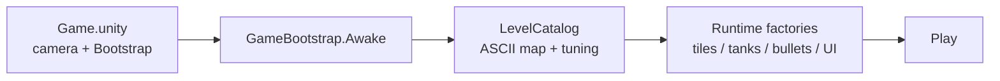

# Battle City — Unity Agentic Clone

A classic **Battle City** (NES tank game) clone built in **Unity 6** as an experiment in
fully agentic game development: every line of gameplay code, every level, and the whole
build/deploy pipeline are authored by Claude from the CLI. The human never touches the
Unity editor except to press **Play** and report what they see.

▶️ **Play it now:** https://hosyvietanh.github.io/auto-game/

  

---

## What it is

Drive your tank, blast through brick walls, destroy every enemy tank, and — above all —
protect your **eagle**. Clear all enemies to advance; lose the eagle (or all your lives)
and it's game over. Ten hand-authored stages ramp from a gentle opener to a swarming
finale.

- **10 levels** with a monotonic difficulty ramp (more enemies, faster spawns, tougher tank mix)
- **3 enemy types** — Basic, Fast, Armored — introduced progressively
- Brick walls you can shoot through, steel walls you can't, and bushes you hide under
- Classic NES look: procedural pixel-art sprites, a pure-black playfield, and a gray
  right-side sidebar HUD (remaining-enemy icons, lives, stage number)
- Score + lives that **carry across levels**, win/lose/level-cleared screens, restart

See **[docs/PRODUCT.md](docs/PRODUCT.md)** for the full product spec.

## Controls

| Action | Keys |
|---|---|
| Move | `WASD` or Arrow keys |
| Fire | `Space` or `Enter` |
| Restart (after win/lose) | `R` |

## Architecture at a glance

Everything is C#. **No prefabs, no hand-edited scenes, no YAML.** One frozen scene holds a
camera and a `Bootstrap` object; every tile, tank, bullet, and UI element is built at
runtime by factory methods. Levels are ASCII string maps. To add an object type you write a
factory method, not a prefab.



Full design — module map, runtime flow, physics layers, testing & deploy — is in
**[docs/ARCHITECTURE.md](docs/ARCHITECTURE.md)**. Agent-facing workflow rules live in
**[CLAUDE.md](CLAUDE.md)**.

## Requirements

- **Unity 6000.2.10f1** (Unity 6.2), URP 3D template, macOS
- Editor binary: `/Applications/Unity/Hub/Editor/6000.2.10f1/Unity.app/Contents/MacOS/Unity`
  (override with the `UNITY_BIN` env var)

## Develop, test, deploy

There are two verification paths. Prefer the **pipeline** path (editor stays open);
fall back to **batch** mode when it's closed. Both are described in detail in
[CLAUDE.md](CLAUDE.md).

```bash
# Pipeline path — editor is OPEN and connected (com.unity.pipeline)
bash scripts/pipe-status.sh            # confirm a live editor is connected
bash scripts/pipe-command.sh recompile # pick up C# edits without editor focus
bash scripts/pipe-test.sh EditMode     # run EditMode tests in the live editor

# Batch path — editor is CLOSED (guarded by Temp/UnityLockfile)
bash scripts/compile-check.sh          # headless compile/import check
bash scripts/run-tests-edit.sh         # EditMode tests (fast, pure C# logic)
bash scripts/run-tests-play.sh         # PlayMode tests (slow — physics/combat)

# Ship a WebGL build to GitHub Pages (editor must be CLOSED)
bash scripts/build-web.sh              # build Build/WebGL (compression Disabled)
bash scripts/deploy-web.sh             # force-push Build/WebGL to gh-pages
```

Logs land in `Logs/` (gitignored). On a failed compile, grep the log for `error CS`.

## Repository layout

```
Assets/Scripts/     gameplay code (asmdef BattleCity, namespace BattleCity)
  Core/  Level/  Tank/  Combat/  Base/  UI/  Editor/
Assets/Tests/       EditMode (pure logic) + PlayMode (physics) tests
Assets/Scenes/      Game.unity — the one frozen scene
scripts/            the agentic loop: pipe-*, compile-check, run-tests-*, build/deploy-web
docs/               PRODUCT.md, ARCHITECTURE.md
CLAUDE.md           agent workflow, gotchas, conventions
```

## Credits

- Sprites: **procedurally generated in C#** (`NesArt.cs`) — classic-NES-style pixel art
  drawn from small pixel grids at runtime, no external art assets. (Kenney CC0 sprites
  remain a silent fallback if present under `Resources/Art/Kenney/`.)
- Built agentically with [Claude Code](https://claude.com/claude-code).
