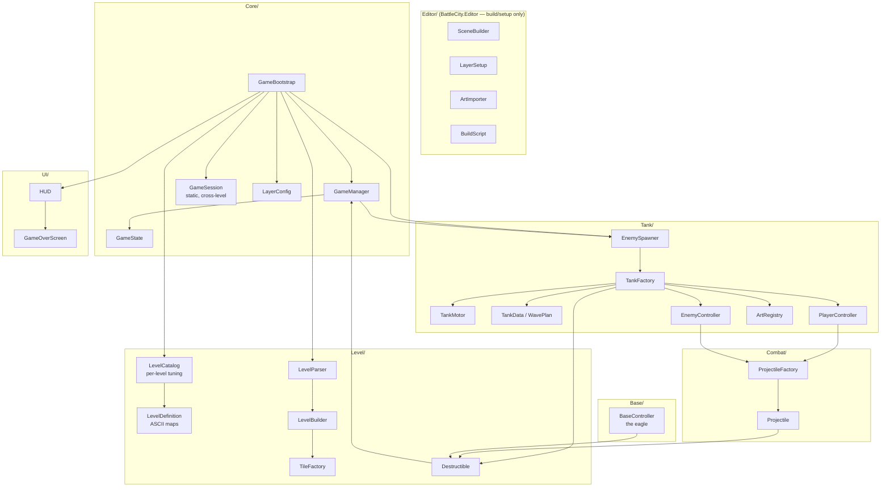
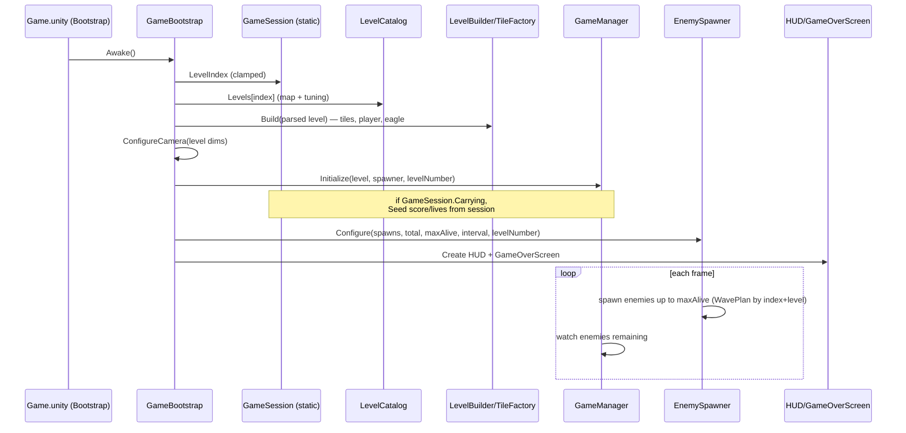
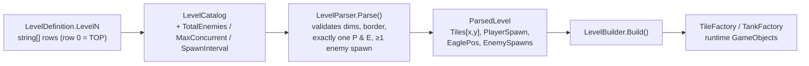
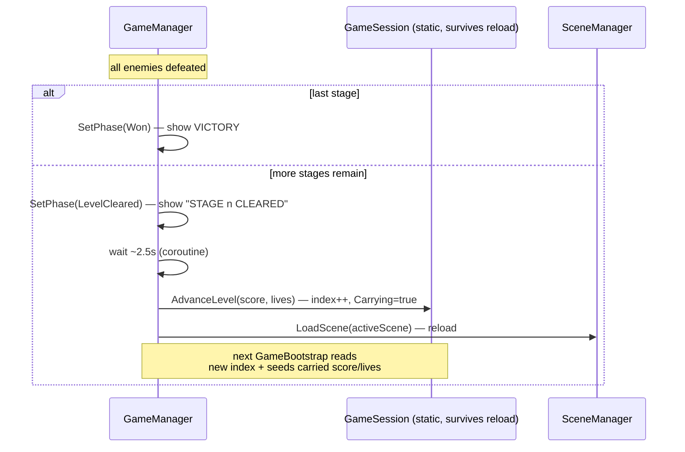
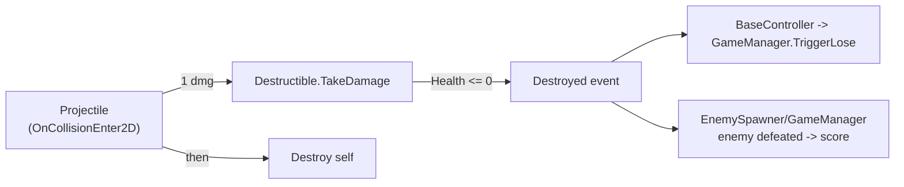
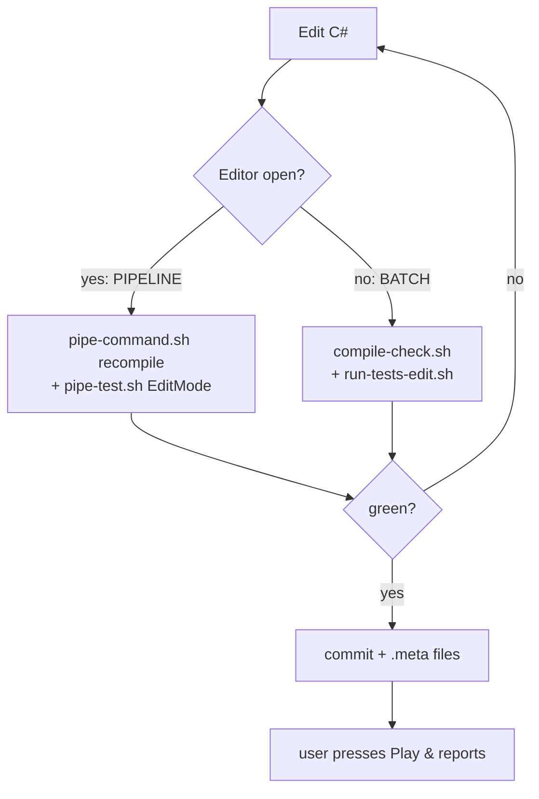
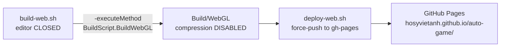

# Architecture — Battle City Clone

> The **how**: code-first design, module map, runtime flow, and the systems that make the
> game work. For the **what/why** see [PRODUCT.md](PRODUCT.md); for the day-to-day agent
> workflow (commands, gotchas, conventions) see [../CLAUDE.md](../CLAUDE.md). This document
> complements CLAUDE.md — it explains the shape of the code, not the loop for changing it.

## 1. Guiding principle: everything is C#, almost nothing is YAML

The project is designed so an AI agent can author and diff the entire game **as text**.
That single decision drives the whole architecture:

- **One scene**, `Assets/Scenes/Game.unity`, generated once by `SceneBuilder` then frozen.
  It contains only an orthographic **camera** and a **`Bootstrap`** GameObject.
- **No `.prefab` files.** Every tile, tank, bullet, and UI element is constructed at runtime
  by **factory methods** (`new GameObject()` + `AddComponent`).
- **Levels are ASCII string maps** in `LevelDefinition.cs`, tuned by `LevelCatalog.cs`.
- **Collision rules, layers, camera, gravity** are all set in code at boot — not in the
  editor's inspector.

To add a new object type you write a factory method; to add a level you write an ASCII map.
There is no hidden state in binary assets that an agent can't read.

## 2. Module map

Code lives in `Assets/Scripts/` (asmdef `BattleCity`, namespace `BattleCity`), with an
editor-only asmdef `BattleCity.Editor` (namespace `BattleCity.EditorTools`).

| Folder | Responsibility |
|---|---|
| **Core/** | Entry point (`GameBootstrap`), run-state (`GameManager` + `GameState`), cross-level progression (`GameSession`), physics setup (`LayerConfig`) |
| **Level/** | ASCII maps (`LevelDefinition`), tuning (`LevelCatalog`), parse (`LevelParser`), instantiate (`LevelBuilder` → `TileFactory`), damage (`Destructible`) |
| **Tank/** | Movement (`TankMotor`), stats & wave mix (`TankData`/`WavePlan`), construction (`TankFactory`), control (`PlayerController`, `EnemyController`), spawning (`EnemySpawner`), sprites (`ArtRegistry`) |
| **Combat/** | Shells (`Projectile`, `ProjectileFactory`) |
| **Base/** | The eagle (`BaseController`) |
| **UI/** | uGUI canvases built from code (`HUD`, `GameOverScreen`) |
| **Editor/** | Build/setup tooling — scene generation, layer names, sprite import, WebGL build |

## 3. Boot & runtime flow (one stage)

`Game.unity` holds a `Bootstrap` GameObject carrying `GameBootstrap`. On `Awake` it reads
the current stage from the static `GameSession`, builds the world from the catalog, and
wires the managers. Nothing is pre-placed in the scene.

`LayerConfig.Setup()` runs at boot too: it **zeroes `Physics2D.gravity`** and configures all
inter-layer collision rules (see §6). Every `Rigidbody2D` also gets `gravityScale = 0`.

## 4. Level pipeline: ASCII → GameObjects

Map characters: `#` steel, `B` brick, `E` eagle, `P` player, `1`–`3` enemy spawns, `.` empty.
Row 0 is the **top** of the arena. `LevelParser` throws on any malformed map, so a typo is
caught by an EditMode test — not by the human pressing Play (see `LevelCatalogTests`).

## 5. Level progression & the scene-reload trick

The game uses a **single scene reloaded per stage**. Because a scene reload wipes all
instance state, cross-level data (which stage, score, lives, whether we're mid-run) lives in
a **static `GameSession`** that survives the reload.

The subtlety: static state also survives across separate **Play** sessions in the editor. So
`GameSession` resets itself **once per Play** via
`[RuntimeInitializeOnLoadMethod(RuntimeInitializeLoadType.SubsystemRegistration)]` → the
next Play always starts clean at stage 1.

`GameState` enforces a **one-way phase machine** (`Playing → LevelCleared/Won/Lost`) so
score/seed changes are ignored once a stage has ended. `GameState.Seed(score, lives)` only
applies while `Playing`, and is how carried progress re-enters a freshly-loaded stage.

## 6. Physics, layers & combat

2D gameplay runs on `SpriteRenderer` + `Rigidbody2D` + 2D colliders inside the 3D URP
template. **URP 2D-renderer features (Light2D etc.) are not used** — the template has no 2D
renderer asset.

Layer numbers are hard-coded `int` constants in `LayerConfig`; their **names** are written
into `TagManager` by the editor tool `LayerSetup`. Collision rules are applied at runtime in
`LayerConfig.Setup()` via `Physics2D.IgnoreLayerCollision` — change them there, never in the
editor UI.

| # | Layer | # | Layer |
|---|---|---|---|
| 8 | PlayerTank | 12 | BrickWall |
| 9 | EnemyTank | 13 | SteelWall |
| 10 | PlayerBullet | 14 | Base (eagle) |
| 11 | EnemyBullet | | |

Key ignore rules (so bullets behave like the original):

- A bullet ignores **its own owner's side** (player bullets pass over player tanks; enemy
  bullets over enemy tanks).
- **Bullet-vs-bullet** collisions are ignored.
- **Player bullets ignore the Base** — only enemy fire can destroy the eagle.

Damage flow is uniform: everything breakable is a `Destructible` (brick, tank, eagle) with
`Health`. A `Projectile` deals its damage to the first `Destructible` it hits, then destroys
itself; `Destructible.TakeDamage` fires a `Destroyed` event on death. The eagle's
`BaseController` listens for that event and calls `GameManager.TriggerLose()`.

Movement note: `TankMotor` drives via `Rigidbody2D` velocity so walls block naturally, snaps
input to a single cardinal axis, and **auto-aligns to the nearest grid line on the
perpendicular axis** so tanks don't snag on wall corners in 1-unit corridors. PlayMode tests
drive `TankMotor` directly — they never simulate Input System key presses (that breaks in
headless batch mode).

## 7. Input & art

- **Input** is created entirely in code by `PlayerController` (`InputAction`s for
  WASD/arrows + Space/Enter). The template's `InputSystem_Actions.inputactions` asset is
  unused.
- **Art**: `ArtRegistry.Load(name)` pulls Kenney sprites from `Resources/Art/Kenney/`. If a
  sprite is missing it returns a generated solid-color square, so the game always renders.
  `ArtImporter` (an `AssetPostprocessor`) forces Sprite/Point/PPU=64 on that folder.
- **Runtime loading rule**: runtime code cannot use `AssetDatabase`; anything loaded at play
  time must live under a `Resources/` folder.

## 8. Testing & CI-of-one

Tests live in `Assets/Tests/`:

- **EditMode** (fast, pure C# logic) — the safety net that catches regressions without a
  human: `LevelCatalogTests` (every map parses, 17×15, steel border, ≥1 enemy spawn,
  monotonic difficulty), `WavePlanTests` (enemy-mix ramp per stage), `GameSessionTests`
  (progression/carry/seed), `GameStateTests` (scoring, lives, one-way phase).
- **PlayMode** (slow, physics) — a handful of tests that drive `TankMotor` and combat
  directly.

Two paths, mutually exclusive by the `Temp/UnityLockfile`:

- **Pipeline** (editor **open**): `com.unity.pipeline` + the standalone `unity` CLI drive
  the *running* editor — `recompile`/`recompile_status`, `run_tests`, `console`,
  `editor_play`/`editor_stop`. Never run `unity test` here (it spawns a colliding batch
  editor).
- **Batch** (editor **closed**): `compile-check.sh`, `run-tests-edit.sh`,
  `run-tests-play.sh` run headless; they refuse to run while the lockfile exists.

See [../CLAUDE.md](../CLAUDE.md) for the exact commands and the beta-tooling caveats.

## 9. Build & deploy

WebGL, served statically from GitHub Pages:

- **Compression must be Disabled** — GitHub Pages can't serve the compressed-stream headers
  Unity emits, so a compressed build 404s the loader.
- The build is batch-mode (`-executeMethod BattleCity.EditorTools.BuildScript.BuildWebGL`),
  so the **editor must be closed**.
- `deploy-web.sh` force-pushes `Build/WebGL` to the `gh-pages` branch via a throwaway
  `GIT_DIR`, then verifies the index and loader return HTTP 200.

## 10. Conventions & gotchas (pointers)

The load-bearing details — lockfile semantics, orthographic camera setup, zeroing gravity,
committing `.meta` files, asmdef references, `-runTests` not combined with `-quit`, the
`Resources/` runtime rule — are documented in **[../CLAUDE.md](../CLAUDE.md) → Gotchas**.
Keep that list authoritative; this doc links to it rather than duplicating it.
