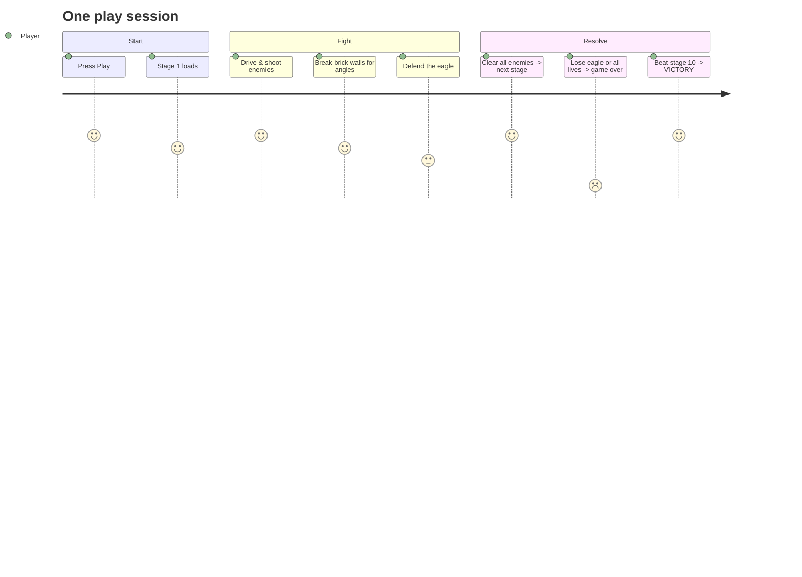
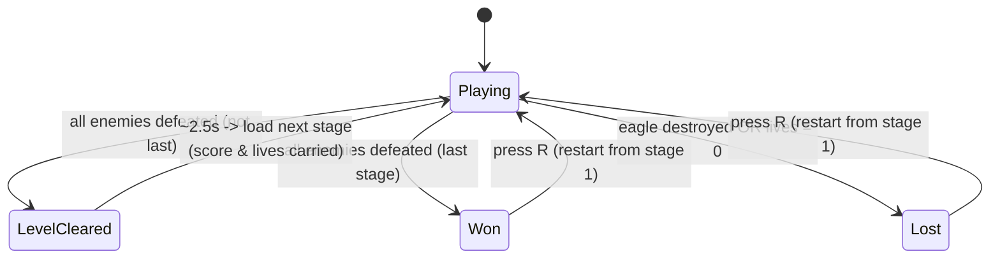
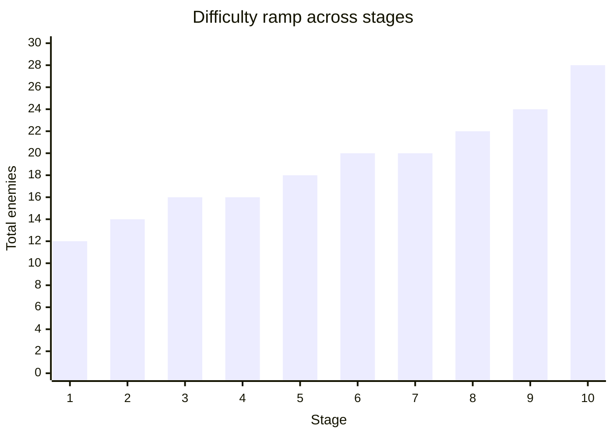

# Product Specification — Battle City Clone

> The **what** and **why** of the game. For the **how** (code design), see
> [ARCHITECTURE.md](ARCHITECTURE.md). For the agentic workflow, see [../CLAUDE.md](../CLAUDE.md).

## 1. Vision

A faithful, bite-sized clone of the 1985 NES **Battle City**: a single-player,
top-down tank shooter where the player defends a base ("the eagle") against waves of
enemy tanks across a series of walled arenas. The clone exists primarily as a testbed for
**fully agentic game development** — the entire game is authored from the CLI by an AI
agent, and a non-technical human validates by playing. Product decisions therefore favor
**mechanics that are verifiable in code and observable in one Play session** over breadth.

## 2. Player experience

The player controls a green tank in a walled arena viewed top-down. They drive in four
directions, fire shells, and must destroy every enemy tank that spawns while keeping their
eagle intact. Clearing all enemies advances to the next, harder stage; the run continues
until the player wins all ten stages or loses.

## 3. Core mechanics

### 3.1 Movement
- **Four-directional**, grid-aligned (classic Battle City has no diagonals). Input snaps to
  the dominant cardinal axis.
- The tank **auto-aligns to the lane** on its perpendicular axis so it doesn't snag on wall
  corners in 1-unit corridors.
- The tank always **faces its last movement direction**; that facing is the fire direction.

### 3.2 Shooting
- Fire in the facing direction. The **player may have only one shell in flight at a time**
  (fire again once the previous shell resolves), matching the original's tension.
- A shell deals 1 damage to the first destructible thing it hits, then disappears.

### 3.3 Tiles / terrain
| Tile | Sprite | Behavior |
|---|---|---|
| **Brick wall** | brick | Destructible — shells break it, opening new firing lanes |
| **Steel wall** | steel | Indestructible — blocks shells and tanks; forms the arena border |
| **Eagle (base)** | eagle | The thing you protect; if destroyed, you lose instantly |
| **Empty** | floor | Drivable |

### 3.4 Enemy tanks
Three types, introduced progressively as stages ramp:

| Type | Speed | Health | Score | Role |
|---|---|---|---|---|
| **Basic** | 2.5 | 1 | 100 | The staple; all you face early |
| **Fast** | 4.0 | 1 | 200 | Quick, fragile; harasses in mid stages |
| **Armored** | 2.0 | 3 | 300 | Slow, takes 3 hits; the late-game threat |

Enemy AI: picks a random cardinal direction every 1.5–4 s and on collision, biased toward
moving down (toward the eagle) on its first move, and fires on a jittered timer.

### 3.5 Win / lose / progression
- **Clear a stage** by destroying every enemy the stage spawns.
- Clearing a non-final stage shows **"STAGE n CLEARED"**, waits ~2.5 s, then loads the next
  stage. **Score and lives carry over.**
- Clearing **stage 10** shows **"VICTORY!"**.
- **Lose** if the eagle is destroyed *or* the player runs out of lives (start with 3).
  Shows **"GAME OVER"**; press **R** to restart from stage 1.

## 4. Level & difficulty design

Ten hand-authored stages, each a **17×15** ASCII map with a full steel border, exactly one
player spawn and one eagle, and 1–3 enemy spawn points.

Difficulty ramps on **two axes at once** (count/pace *and* enemy mix), monotonically:

| Axis | Stage 1 | Stage 10 | How it ramps |
|---|---|---|---|
| **Total enemies** | 12 | 28 | more tanks to clear |
| **Max concurrent** | 2 | 6 | more on screen at once |
| **Spawn interval** | 3.5 s | 1.1 s | tanks arrive faster |
| **Enemy mix** | all Basic | Basic + Fast + Armored | Fast enters ~stage 3, Armored ~stage 5 |

The mix is deterministic per stage (a function of enemy index and stage number), so a given
stage always plays the same — important for reproducible verification.

## 5. Presentation

- **2D gameplay inside Unity's 3D URP template**: sprite renderers + 2D physics. Camera is
  orthographic and framed to the level dimensions.
- **HUD**: score, lives, enemies remaining, and **STAGE n/10**.
- **Art**: Kenney CC0 sprites; if a sprite is missing, the game falls back to a generated
  solid-color square so it always runs.
- Consistent z-ordering: floor < walls < eagle < tanks < bullets < effects.

## 6. Current feature state

**Implemented and verified:** all mechanics above — 4-dir movement with lane auto-align,
single-shell firing, brick/steel/eagle tiles, three enemy types with AI, 10 stages with the
two-axis ramp, score/lives carry-over, HUD with stage counter, win/level-cleared/lose
screens, and R-to-restart. Live on GitHub Pages.

**Deliberately out of scope (for now):** power-ups, two-player co-op, sound, per-frame
animation, high-score persistence, and a level editor. These are natural extensions but
were not selected for the current milestone.

## 7. Non-goals / constraints

- **No prefabs or hand-edited scene content** — everything is built from code so an agent
  can author and diff it as text. (See [ARCHITECTURE.md](ARCHITECTURE.md).)
- **Every gameplay rule must be testable in EditMode** where possible (level parsing, wave
  mix, progression, scoring) so regressions are caught without a human pressing Play.
- Faithful-to-original feel is preferred over new mechanics.
